# llm-trader-rag Architecture

## Table of Contents

1. [System Overview](#system-overview)
2. [Complete System Flow](#complete-system-flow)
3. [Service Responsibilities](#service-responsibilities)
4. [RAG Service Role](#rag-service-role)
5. [Detailed Flow Diagrams](#detailed-flow-diagrams)
6. [JSON-RPC API](#json-rpc-api)
7. [LMDB Integration](#lmdb-integration)
8. [Design Rationale](#design-rationale)

---

## System Overview

**Important**: This project (`llm-trader-rag`) is a **pure retrieval service** that does NOT use OpenAI or any LLM clients directly. It is designed as a service layer that is queried by `workflow-manager` for historical pattern matching.

### Complete Trading System Architecture

The llm-trader-rag service is **Phase 2** in a 6-phase trading system:

1. **Phase 1: Data Collection** (`llm-trader-data`) - Fetches market data & persists to LMDB
2. **Phase 2: Historical Analysis** (`llm-trader-rag`) - **THIS SERVICE** - RAG pattern matching
3. **Phase 3: LLM Decision** (`workflow-manager`) - Claude analysis with RAG context
4. **Phase 4: Risk Validation** (Risk Manager)
5. **Phase 5: Order Execution** (Order Bot)
6. **Phase 6: Position Management** (Position Monitor)

---

## Complete System Flow

### High-Level Architecture Diagram

```mermaid
flowchart TB
    subgraph External["🌐 External Data Sources"]
        Bybit["Bybit Exchange
        📊 REST API + WebSocket"]
    end

    subgraph DataService["📈 llm-trader-data (Data Collection)"]
        DataGatherer["Data Gatherer
        • Fetch OHLCV
        • Calculate indicators
        • Build snapshots"]
        LMDB[("💾 LMDB Storage
        400 days retention
        ~5GB")]
        DataGatherer -->|"Write candles
        + indicators"| LMDB
    end

    subgraph RAGService["🔍 llm-trader-rag (THIS SERVICE)"]
        RAG["RAG Service
        • Query patterns
        • Vector search
        • Historical analysis"]
        LMDB -->|"Read historical
        data (concurrent)"| RAG
    end

    subgraph WorkflowManager["🤖 workflow-manager (Decision Engine)"]
        RPCServer["RPC Server
        Port 7878"]
        StrategyAgent["Strategy Agent
        🧠 Claude LLM"]
        RPCServer -->|"Receive
        snapshot"| StrategyAgent
        RAG -->|"RAG context"| StrategyAgent
        StrategyAgent -->|"Trading
        decision"| Decision{"Decision
        Type?"}
    end

    subgraph BotExecution["⚡ Bot Execution (Order Management)"]
        OrderBot["Order Execution Bot
        • Place orders
        • Manage positions
        • Monitor fills"]
        Bybit2["Bybit Exchange
        📤 Order API"]
    end

    Bybit -->|"Market data"| DataGatherer
    DataGatherer -->|"POST /snapshot
    JSON-RPC 2.0"| RPCServer
    Decision -->|"BUY/SELL"| OrderBot
    Decision -->|"HOLD"| NoAction["❌ No Action"]
    OrderBot -->|"Submit orders"| Bybit2
    Bybit2 -->|"Order status
    Fill events"| OrderBot

    style DataGatherer fill:#1a4d7a,stroke:#4da6ff,stroke-width:3px,color:#fff
    style LMDB fill:#7a5c00,stroke:#ffcc00,stroke-width:3px,color:#fff
    style RAG fill:#5c1a7a,stroke:#cc66ff,stroke-width:3px,color:#fff
    style StrategyAgent fill:#1a7a1a,stroke:#66ff66,stroke-width:3px,color:#fff
    style OrderBot fill:#7a1a1a,stroke:#ff6666,stroke-width:3px,color:#fff
    style Decision fill:#7a7a00,stroke:#ffff66,stroke-width:2px,color:#fff
    style NoAction fill:#4d4d4d,stroke:#999,stroke-width:2px,color:#fff
```



**Flow Explanation:**

1. **Data Gathering** (llm-trader-data):
   - Fetches real-time market data from Bybit
   - Calculates technical indicators
   - Persists to LMDB for historical analysis
   - Posts current snapshot to workflow-manager

2. **Pattern Matching** (llm-trader-rag - THIS SERVICE):
   - Reads historical data from LMDB
   - Finds similar patterns using vector search
   - Analyzes historical outcomes
   - Returns RAG context to workflow-manager

3. **Decision Making** (workflow-manager):
   - Receives snapshot from llm-trader-data
   - Queries llm-trader-rag for historical context
   - Enriches snapshot with RAG data
   - LLM analyzes and makes trading decision

4. **Execution** (Bot):
   - Receives BUY/SELL decision from workflow-manager
   - Places orders on Bybit
   - Monitors order fills
   - Reports execution status

---

## Data Flow

```
llm-trader-data → sends market snapshot JSON → workflow-manager
                                                      ↓
                                         workflow-manager queries via JSON-RPC
                                                      ↓
                                               llm-trader-rag
                                               (THIS SERVICE)
                                                      ↓
                                         returns historical matches + statistics
                                                      ↓
                                         workflow-manager formats prompt with RAG
                                                      ↓
                                         workflow-manager → LLM → trade decision
```

## Service Responsibilities

### llm-trader-rag (This Project)
- **Does NOT query exchanges** - no direct API calls to Bybit/Binance
- **Does NOT call LLMs** - no OpenAI/Anthropic clients
- **Does**:
  - Provides JSON-RPC server (port 7879)
  - Queries Qdrant vector database
  - Returns historical pattern matches
  - Pure retrieval service

### llm-trader-data
- Fetches historical data from exchanges (Bybit, Binance)
- Stores data in LMDB
- Sends market snapshots to workflow-manager

### workflow-manager
- Receives market snapshots from llm-trader-data
- Queries llm-trader-rag for historical patterns (JSON-RPC)
- Formats LLM prompts with RAG context
- Calls LLM APIs (OpenAI, Anthropic)
- Executes trading decisions

---

## RAG Service Role

### llm-trader-rag (This Project)

**Purpose**: RAG (Retrieval-Augmented Generation) retrieval service for historical pattern matching

**Responsibilities**:
- Exposes JSON-RPC 2.0 API (port 7879)
- Reads historical data from LMDB (read-only, concurrent access)
- Generates embeddings from current market state
- Queries Qdrant vector database for similar patterns
- Returns historical matches with outcomes
- Calculates aggregate statistics (win rates, avg outcomes, etc.)

**Does NOT**:
- Make direct LLM API calls (OpenAI, Anthropic, etc.)
- Query exchanges (Bybit, Binance, etc.)
- Make trading decisions
- Write to LMDB (read-only access)

---

## Detailed Flow Diagrams

### 1. Complete End-to-End Trading Cycle

```mermaid
flowchart TB
    subgraph Phase1["📊 Phase 1: Data Collection"]
        A1["Bybit Exchange"] -->|"Market Data"| A2["llm-trader-data"]
        A2 -->|"Write"| A3[("💾 LMDB Storage")]
        A2 -->|"POST /snapshot"| A4["workflow-manager RPC"]
    end

    subgraph Phase2["🔍 Phase 2: Historical Analysis (THIS SERVICE)"]
        A4 -->|"Query patterns"| B1["llm-trader-rag"]
        A3 -->|"Read historical"| B1
        B1 -->|"Similar patterns
        Success rates"| B2["RAG Context"]
    end

    subgraph Phase3["🧠 Phase 3: LLM Decision"]
        B2 -->|"Enrich snapshot"| C1["Strategy Agent"]
        C1 -->|"Analyze with context"| C2["Claude LLM"]
        C2 -->|"Decision"| C3{"Action?"}
    end

    subgraph Phase4["🛡️ Phase 4: Risk Validation"]
        C3 -->|"BUY/SELL"| D1["Risk Manager"]
        D1 -->|"Check limits"| D2{"Valid?"}
        D2 -->|"✅ Yes"| D3["Calculate Size"]
        D2 -->|"❌ No"| D4["Reject Trade"]
    end

    subgraph Phase5["⚡ Phase 5: Order Execution"]
        D3 -->|"Place orders"| E1["Order Execution Bot"]
        E1 -->|"Entry order"| E2["Bybit API"]
        E1 -->|"Stop loss order"| E2
        E1 -->|"Take profit order"| E2
        E2 -->|"Order fills"| E3["Position Monitor"]
    end

    subgraph Phase6["📈 Phase 6: Position Management"]
        E3 -->|"Monitor PnL"| F1{"Exit
        Condition?"}
        F1 -->|"🔻 SL Hit"| F2["Close @ Loss"]
        F1 -->|"✅ TP Hit"| F3["Close @ Profit"]
        F1 -->|"⏳ Ongoing"| E3
    end

    subgraph FeedbackLoop["🔄 Feedback Loop"]
        F2 -->|"Update positions"| G1["Account State"]
        F3 -->|"Update positions"| G1
        G1 -->|"Next cycle"| A2
    end

    C3 -->|"HOLD"| H1["❌ No Action"]
    H1 -->|"Log decision"| G1

    style A2 fill:#1a4d7a,stroke:#4da6ff,stroke-width:3px,color:#fff
    style A3 fill:#7a5c00,stroke:#ffcc00,stroke-width:3px,color:#fff
    style B1 fill:#5c1a7a,stroke:#cc66ff,stroke-width:3px,color:#fff
    style C2 fill:#1a7a1a,stroke:#66ff66,stroke-width:3px,color:#fff
    style E1 fill:#7a1a1a,stroke:#ff6666,stroke-width:3px,color:#fff
    style F3 fill:#0d5c0d,stroke:#66ff66,stroke-width:3px,color:#fff
    style F2 fill:#7a0d0d,stroke:#ff6666,stroke-width:3px,color:#fff
    style C3 fill:#7a7a00,stroke:#ffff66,stroke-width:2px,color:#fff
    style D2 fill:#7a7a00,stroke:#ffff66,stroke-width:2px,color:#fff
    style F1 fill:#7a7a00,stroke:#ffff66,stroke-width:2px,color:#fff
```



**THIS SERVICE (llm-trader-rag) operates in Phase 2**, providing historical context to the decision-making process.

---

### 2. RAG Service Internal Query Flow


**Key Points:**
- Queries LMDB for historical data (read-only, no blocking)
- Extracts features from current state and historical windows
- Uses vector embeddings for similarity search
- Analyzes future outcomes of similar patterns
- Returns RAG context with success rates

---

### 3. workflow-manager Integration Flow

```mermaid
sequenceDiagram
    participant Data as llm-trader-data
    participant RPC as RPC Server<br/>(workflow-manager)
    participant RAG as llm-trader-rag<br/>(THIS SERVICE)
    participant Agent as Strategy Agent
    participant LLM as Claude LLM
    participant Bot as Order Execution Bot

    Data->>RPC: POST /snapshot<br/>{snapshot_id, account, positions, market_data}
    RPC->>RPC: Validate snapshot schema
    RPC->>RPC: Check duplicate (snapshot_id)
    RPC->>RPC: Enqueue snapshot

    Note over RPC,LLM: Enrich with RAG Context
    RPC->>RAG: POST /query/patterns<br/>{BTCUSDT: current_indicators}
    RAG-->>RPC: {similar_patterns[], success_rate, volatility_context}

    RPC->>Agent: execute(enriched_snapshot)
    Agent->>Agent: Build LLM prompt:<br/>• Current market state<br/>• RAG historical patterns<br/>• Open positions<br/>• Risk controls

    Agent->>LLM: Prompt with RAG context
    LLM->>LLM: Analyze:<br/>• Price action vs historical patterns<br/>• Momentum reliability (73% success)<br/>• Volatility percentile (68th)<br/>• Risk/reward ratio
    LLM-->>Agent: Decision:<br/>{<br/>  action: "BUY",<br/>  symbol: "BTCUSDT",<br/>  entry: 68000,<br/>  stop_loss: 67200,<br/>  take_profit: 70400,<br/>  reasoning: "..."<br/>}

    Note over Agent,Bot: Execute Decision
    alt BUY or SELL
        Agent->>Bot: execute_trade(decision)
        Bot->>Bot: Validate risk controls
        Bot->>Bot: Calculate position size
        Bot-->>Agent: {order_placed: true, order_id: "123"}
    else HOLD
        Agent->>Agent: Log decision (no action)
    end

    Agent-->>RPC: {success: true, decision, execution_status}
    RPC-->>Data: HTTP 200 OK
```



**Key Points:**
- Receives snapshot from llm-trader-data
- Queries llm-trader-rag for historical context
- Enriches snapshot with RAG data
- LLM analyzes with historical patterns
- Makes BUY/SELL/HOLD decision
- Passes to bot for execution (if BUY/SELL)

---

## JSON-RPC API

### Endpoint
- **Host**: localhost (configurable)
- **Port**: 7879 (configurable)
- **Protocol**: JSON-RPC 2.0 over TCP

### Method: `rag.query_patterns`

**Request**:
```json
{
  "jsonrpc": "2.0",
  "id": 1,
  "method": "rag.query_patterns",
  "params": {
    "symbol": "BTCUSDT",
    "timestamp": 1730811225000,
    "current_state": {
      "price": 68500.50,
      "rsi_7": 83.6,
      "rsi_14": 78.2,
      "macd": 72.8,
      "ema_20": 68200.0,
      "ema_20_4h": 67800.0,
      "ema_50_4h": 67200.0,
      "funding_rate": 0.0001,
      "open_interest_latest": 1500000000.0,
      "open_interest_avg_24h": 1450000000.0
    },
    "query_config": {
      "lookback_days": 90,
      "top_k": 5,
      "min_similarity": 0.7
    }
  }
}
```

**Response**:
```json
{
  "jsonrpc": "2.0",
  "id": 1,
  "result": {
    "matches": [
      {
        "similarity": 0.89,
        "timestamp": 1725552000000,
        "date": "2025-09-05T14:00:00Z",
        "market_state": {
          "rsi_7": 82.1,
          "rsi_14": 76.8,
          "macd": 68.4,
          "ema_ratio": 1.009,
          "oi_delta_pct": 4.2,
          "funding_rate": 0.00015
        },
        "outcomes": {
          "outcome_1h": -0.8,
          "outcome_4h": -2.3,
          "outcome_24h": -4.1,
          "max_runup_1h": 0.5,
          "max_drawdown_1h": -2.5,
          "hit_stop_loss": true,
          "hit_take_profit": false
        }
      }
    ],
    "statistics": {
      "total_matches": 5,
      "avg_similarity": 0.85,
      "outcome_4h": {
        "mean": -0.51,
        "median": -0.3,
        "win_rate": 0.4
      }
    },
    "metadata": {
      "query_duration_ms": 145,
      "schema_version": 1,
      "feature_version": "v1_nofx_3m4h"
    }
  }
}
```

See `docs/architecture/jsonrpc_api.md` for complete API specification

---

## LMDB Integration

### Read-Only Access Pattern

This service reads historical data from the same LMDB storage that llm-trader-data writes to:

```
┌─────────────────────────────────────────────────────────────┐
│                    LLM-TRADER-RAG SERVICE                    │
│                         (THIS SERVICE)                        │
│                                                              │
│  ┌───────────────────────────────────────────────────────┐  │
│  │              LMDBReader (Read-Only)                   │  │
│  │                                                       │  │
│  │  - Opens LMDB environment with read-only flag        │  │
│  │  - No write transactions                             │  │
│  │  - MVCC ensures no blocking                          │  │
│  │                                                       │  │
│  │  Methods:                                            │  │
│  │    • query_candles(symbol, start_ms, end_ms)        │  │
│  │    • query_indicators(symbol, start_ms, end_ms)     │  │
│  │    • find_similar_patterns(current_state)           │  │
│  └────────────────────────┬──────────────────────────────┘  │
│                           │                                  │
│                           ▼                                  │
│  ┌───────────────────────────────────────────────────────┐  │
│  │            Pattern Matching Engine                    │  │
│  │                                                       │  │
│  │  - Vector embeddings of price patterns               │  │
│  │  - Cosine similarity search                          │  │
│  │  - Historical outcome analysis                       │  │
│  │  - Success rate calculation                          │  │
│  └────────────────────────┬──────────────────────────────┘  │
│                           │                                  │
│                           ▼                                  │
│  ┌───────────────────────────────────────────────────────┐  │
│  │              RAG Context Builder                      │  │
│  │                                                       │  │
│  │  - Assemble top-N similar patterns                   │  │
│  │  - Include market context                            │  │
│  │  - Format for LLM consumption                        │  │
│  └────────────────────────┬──────────────────────────────┘  │
└────────────────────────────┼──────────────────────────────┘
                             │
                             │ RAG Context
                             │ (JSON payload)
                             ▼
                   ┌──────────────────────┐
                   │  WORKFLOW-MANAGER    │
                   │                      │
                   │  Strategy Agent      │
                   │  - Receives snapshot │
                   │  - Enriches w/ RAG   │
                   │  - Makes decision    │
                   └──────────────────────┘
```

### LMDB Database Schema

LMDB uses **four separate named databases** to organize data:

#### 1. `candles_3m` - 3-Minute Candles
- **Purpose**: Intraday price action for short-term patterns
- **Key Format**: `{symbol}:{timestamp_ms}` (e.g., `BTCUSDT:1730818800000`)
- **Value**: JSON with OHLCV data
- **Retention**: 400 days

#### 2. `candles_4h` - 4-Hour Candles
- **Purpose**: Longer-term trends and swing patterns
- **Key Format**: `{symbol}:{timestamp_ms}`
- **Value**: JSON with OHLCV data
- **Retention**: 400 days

#### 3. `indicators_3m` - 3-Minute Technical Indicators
- **Purpose**: Short-term technical analysis signals
- **Key Format**: `{symbol}:{timestamp_ms}`
- **Value**: JSON with EMA, MACD, RSI, ATR values
- **Retention**: 400 days

#### 4. `indicators_4h` - 4-Hour Technical Indicators
- **Purpose**: Longer-term momentum and volatility signals
- **Key Format**: `{symbol}:{timestamp_ms}`
- **Value**: JSON with technical indicators
- **Retention**: 400 days

### LMDBReader Interface

**Location**: `src/storage/lmdb_reader.py`

```python
class LMDBReader:
    """Read-only LMDB access for RAG service."""

    def __init__(self, db_path: str):
        """Initialize read-only LMDB environment."""
        self.env = lmdb.open(
            db_path,
            readonly=True,      # READ-ONLY mode
            lock=False,         # No write locks
            max_dbs=4,
            map_size=10 * 1024**3,
        )

    def query_candles_range(
        self,
        symbol: str,
        start_ms: int,
        end_ms: int,
        interval: str = "3m"
    ) -> List[Dict[str, Any]]:
        """Query candles within time range using cursor scan."""
        # Efficiently scans key range using LMDB cursors
        pass

    def query_indicators_latest(
        self,
        symbol: str,
        interval: str = "3m",
        count: int = 10
    ) -> List[Dict[str, Any]]:
        """Query most recent N indicators for symbol."""
        # Queries latest indicator values
        pass
```

### Performance Characteristics

- **Read Latency**: <1ms for single key lookup (memory-mapped, zero-copy)
- **Range Scans**: ~10ms for 1000 records
- **Concurrency**: No blocking (MVCC - Multi-Version Concurrency Control)
- **Cache**: OS page cache (automatic)

### Deployment Configuration

**Docker Compose**:
```yaml
services:
  llm-trader-data:
    volumes:
      - trading-data:/shared/data/trading  # Read-write mount

  llm-trader-rag:
    volumes:
      - trading-data:/shared/data/trading:ro  # Read-only mount (:ro)

volumes:
  trading-data:  # Named volume for LMDB
```

**Key Points**:
- Both services access same LMDB files
- llm-trader-data: Read-write mount
- llm-trader-rag: Read-only mount (`:ro` flag)
- MVCC ensures no blocking between writer and readers

---

## Design Rationale

This separation of concerns allows:

1. **Modularity**: RAG functionality is isolated and reusable
   - Can be used by multiple consumers
   - Easy to swap embedding models or vector databases
   - Clear API boundaries

2. **Scalability**: Each service can scale independently
   - RAG service can be horizontally scaled
   - LMDB concurrent reads support multiple RAG instances
   - No tight coupling between components

3. **Separation of Concerns**: Data retrieval vs. LLM interaction vs. workflow management
   - llm-trader-data: Data gathering and persistence
   - llm-trader-rag: Historical pattern matching (THIS SERVICE)
   - workflow-manager: LLM orchestration and decisions

4. **Testing**: RAG functionality can be tested without LLM API calls
   - Mock historical data queries
   - Test pattern matching algorithms
   - Validate vector search accuracy
   - No expensive LLM API calls in tests

---

## System Component Summary

### Complete Architecture Overview

| Component | Purpose | Repository | Technologies |
|-----------|---------|------------|--------------|
| **llm-trader-data** | Data collection & persistence | `../llm-trader-data` | Python, Bybit API, LMDB |
| **llm-trader-rag** | Pattern matching & RAG retrieval | **THIS REPO** | Python, LMDB Reader, Qdrant, JSON-RPC |
| **workflow-manager** | LLM orchestration & decisions | `../workflow-manager` | TypeScript, Claude API, JSON-RPC Server |
| **Order Bot** | Order execution & management | Part of workflow-manager | TypeScript, Bybit Order API |
| **Position Monitor** | Position tracking & exit logic | Part of workflow-manager | TypeScript |

### Data Flow Summary

```
Bybit Exchange
    ↓ (Market Data)
llm-trader-data
    ↓ (Write to LMDB)
LMDB Storage ←─────────────┐
    ↓ (Snapshot)            │ (Read historical)
workflow-manager            │
    ↓ (Query RAG)           │
llm-trader-rag ─────────────┘
    ↓ (RAG Context)
workflow-manager
    ↓ (Enriched Prompt)
Claude LLM
    ↓ (Trading Decision)
Order Bot
    ↓ (Place Orders)
Bybit Exchange
```

### Timing & Performance

- **Data Collection**: Continuous (WebSocket) + every 60s (snapshot)
- **RAG Query**: ~500ms per pattern search
- **LLM Decision**: ~2-5 seconds per snapshot
- **Order Execution**: <1 second
- **Position Monitoring**: Every 10 seconds
- **Total Decision Cycle**: ~60-70 seconds

### Storage & Retention

- **LMDB Size**: ~5GB for 10 symbols × 400 days
- **Retention**: 400 days (configurable)
- **Cleanup**: Hourly automated cleanup
- **Read Performance**: <1ms (memory-mapped)
- **Write Performance**: >1000 records/second

---

## No Direct LLM Usage

**Important**: This project deliberately avoids:

- OpenAI client imports
- Direct API calls to LLM providers
- LLM-specific configuration or credentials
- Token management or rate limiting for LLMs

**All LLM interactions happen in the workflow-manager, not in this service.**

This service is a **pure retrieval layer** that:
- Queries historical data from LMDB
- Performs vector similarity search
- Calculates outcome statistics
- Returns structured JSON responses

The workflow-manager consumes this data and formats it into prompts for the LLM.

---

## References

### Internal Documentation
- `docs/architecture/jsonrpc_api.md` - Complete JSON-RPC API specification
- `README.md` - Project setup and usage
- `docs/INTEGRATION_SUMMARY.md` - Integration guide

### Related Services
- `llm-trader-data` - Data collection service (writes to LMDB)
- `workflow-manager` - LLM orchestration service (queries this RAG service)

### External Resources
- [LMDB Documentation](http://www.lmdb.tech/doc/)
- [JSON-RPC 2.0 Specification](https://www.jsonrpc.org/specification)
- [Qdrant Vector Database](https://qdrant.tech/)

---

## Document Version

- **Version**: 2.0
- **Last Updated**: 2025-11-05
- **Author**: llm-trader-rag development team
- **Status**: Production-ready with complete system diagrams
